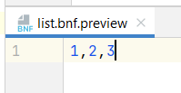
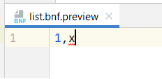

# Parser Expression Grammars in Grammar Kit

Jet Brains [Grammar Kit](https://github.com/JetBrains/Grammar-Kit) is a powerful 
parser generator, but it follows a slightly different theoretical framework than
most parser generators I am familiar with and there isn't much documentation
available for it. On top of this it actually uses a combination of two
different types of parser generator which I found quite confusing.
There are a few readme and tutorial files in the github repo, but they seem
to asu assume that you already have a good understanding of
parser generation. For someone like me, who took one (1) undergrad course on
compiler design 20 years ago, this is all a lot to take in at once. The following 
article is based on some notes I put together to help understand how it all works. 

Most parser generators are based on Context Free Grammars (CFGs), but Grammar
Kit is based on Parsing Expression Grammars (PEGs). These are very similar, but
just different enough to cause confusion. In order to explain how Grammar Kit
works, I am going to go through some worked examples and show how Grammar
Kit's behaviour differs from Bison, which is a more traditional a CFG based 
parser generation. I'll try to avoid going into detail on the theory side of 
things and instead focus more on the practical differences. Before I can do 
that though, I'll give a brief overview of Parsers, Parser Generators and 
Grammars first.

## Parsers, Parser Generators and Grammars

Parsers are programs that read in a stream of characters and turn them into
a tree structure. For example, given the following input:

```
1 + 2 + 3
```
We might expect the parser to produce the following tree:
```
(+)
 |- num: 1
 |-(+)
    |- num: 2
    |- num: 3
```

It's possible to write a parser manually in a regular programming language
like C or Java, but often the parser is written using a specialised language
designed for specifying languages. The language for describing languages is
known as a Grammar, and the tool which processes this language and produces a
parser is known as a Parser Generator.

Bison is a very widely used parser generator that is based on Context Free
Grammars (CFGs). CFGs have four components:
1. A set of tokens which map to fragments of text in the code being parsed.
   These are known as *terminal* symbols
1. A set of abstract, non-terminal symbols
1. A set of rules, called *productions* which state how non-terminal symbols
   can transformed into 0 or more symbols (which each could be terminal or non-terminal.)
   The non-terminal being transformed is called the *left side* of the production.
   The list of symbols that it is transformed into is called the *right side*
1. A start symbol.

Grammar Kit uses a Parser Expression Grammars. Just like CFGs, these have a set
of terminals, non terminals, productions and start symbol, but unlike CFGs, in
PEGs the order of that rules are specified in has significance.

Both of these grammars (CFG) are typically written using a notation called
[Bakus-Naur Form](https://en.wikipedia.org/wiki/Backus%E2%80%93Naur_form). If
we wanted to specify a language that consists of lists of integers, we could
use the following grammar.

```
list -> list , digit  
list -> digit
digit -> 0 | 1 | 2 | 3 | 4 | 5 | 6 | 7 | 8 | 9
```

Our start symbol is *list*. The productions state that the non-terminal *list*
symbol can be replaced by several options. Either we can replace it with
another *list* symbol, the terminal ',' token, and the non-terminal *digit* token, 
**or** we can replace it with a single *digit* symbol.

The *digit* symbol can be replaced by a terminal digit character. The '|'
operator is used to denote a choice of productions. The above could be
re-written as:

```
list -> list , digit |
        digit
digit -> 0 | 1 | 2 | 3 | 4 | 5 | 6 | 7 | 8 | 9
```

## Generating a simple parser in Grammar Kit
OK, now that we have shown an example of a grammar, let's try making a
parser in Gramar Kit. Fire up Intellij, go to the create a new project 
dialog and tick the checkbox for "Intellij Platform Plugin" before
actually creating the new project. Inside the project create a file 
called `list.bnf` and enter the following:

```bnf
{
  tokens = [
      DIGIT="regexp:\d"
      ]
}
list ::= list ',' DIGIT |
         DIGIT
```

This is a little different from the BNF example above. Some of the diffences
are simple syntax changes. The left and right hand sides of productions 
are separated using `::=` instead of `->` and non-terminal literals are 
wrapped in single quotes. A much bigger difference is how we have specified
the `DIGIT` terminal token. Here it is recognised using a regex pattern
instead of using a literal.

Assuming you have syntax highlighting turned on, then you should see a 
warning that "'list' employs left-hand recursion unsupported by 
generator". This is fixed easily enough, you can just swap things around
to use right-handed recursion as follows:

```bnf
list ::= DIGIT ',' list |
         DIGIT
```

You can check that this grammar works by right-clicking on the `list.bnf` 
file and selecting "Live Preview". This will open a window where you 
can type some text and see if it parses. Try "1,2,3", it should show with
no errors.



Try "1,x" - this should show an error on the 'x' character.

.

OK, that all seems to be working as expected. Still though, if you are 
used to defining grammars in Bison, then the need to get rid of 
left-handed recursion is kind of strange. Both left and right-handed recursion
will work in Bison, but left-handed recursion is preferred as it is more 
efficient.

This inability to work with left-hand recursion is one of the most 
noticeable differences between Grammar Kit and Bison, but it is due to 
implementation detail of Grammar Kit's standard parser generator, which 
uses a top-down parsing. Grammar Kit has a second type of generator which 
*does* handle left-hand recursion, but we will hold off discussing this until a later
section.

A more fundamental difference can be seen if we switch the order of the
alternative productions for *list*. Change the ordering as follows:

```bnf
list ::= DIGIT |
         DIGIT '+' list |
         DIGIT '-' list
```
Open up the live preview again and try "1+1".


Well that's not right... For some reason it won't recognise the '+' symbol. Why 
is this? In PEGs the order of the productions matters. Because the production
for `list -> digit` comes before the production for `list -> digit + list`, 
and the PEG based parser will always pick the first production that matches.
  
In a CFG based parser generator like Bison, you do not need to worry about ordering
your productions correctly, but in Grammar Kit you do. This seems like a big 
disadvantage for Grammar Kit, but if we look at a more advanced example we will 
see that there are times when the ordering of productions can make defining a
grammar more straightforward.

## Dealing with operator precedence

Let's add the `*` and `/` operators into our grammar. You might think we could
use something like this:
```
expr -> expr + digit |
        expr - digit |
        expr * digit |
        expr / digit
digit -> 0 | 1 | 2 | 3 | 4 | 3 | 4 | 5 | 6 | 7 | 8 | 9
```

This isn't going to work though, as `*` and `/` have higher precedence than `+`
and `-`. Given the expression `1 + 2 * 3`, this must be evaluated as 
`1 + (2 * 3)` and not `(1 + 2) * 3`. Unfortunately, in a CFG based parser
generator like Bison, the above grammar will generate the following tree
```
(*)
 |-(+)
 |  |-value: 1
 |  |-value: 2
 |-value: 3
```
This corresponds to `(1 + 2) * 3`, which is wrong.

As CFGs have no concept of operator precedence, you have to use quite a convoluted
approach to defining the grammar for expressions. You need to use the following:

```
expr -> expr + term |
        expr - term | 
        term
term -> term * factor |
        term / factor |
        factor
factor -> digit | ( expr )
```

This isn't very intuitive at first, but basically we hae said that addition and subtraction
are completely different from multiplication and division and set up our rules so that the
trees can only be built up in a way that is consistent with our understanding of algebra. 
In addition to the productions for the binary operators, we have one for parentheses, which
allows us to override how the tree is going to be built up.

Let's take a look at how a grammar like this is used in practice. A Bison parser using this 
grammar can be seen in [calc.y](calc.y). Unlike Grammar-Kit, Bison does not provide you with
data structures to store the results of your parsing, and you must create these yourself.
I have implemented a simple structure in [tree.c](tree.c) and [tree.h](tree.h), and then
in each of the productions in `clac.y`, I provide instructions for building up a tree 
using the `new_val(int)` and `node *new_op(op_type, node *, node *)` functions. 

The tree building section is as follows: 

```bison
expr: 
    expr '+' term   { $$ = new_op(PLUS_NODE, $1, $3); }
|   expr '-' term   { $$ = new_op(MINUS_NODE, $1, $3); }
|   term            { $$ = $1; }
;

term: 
    term '*' factor { $$ = new_op(MUL_NODE, $1, $3); }
|   term '/' factor { $$ = new_op(DIV_NODE, $1, $3); }
|   factor          { $$ = $1; }
;

factor: 
    NUM             { $$ = new_value($1); }
|   '(' expr ')'    { $$ = $2; }
;
```
Having to define my own data structure, and having to state explicitly how to construct
the tree is a lot more work than I had to do when working with Grammar-Kit, but it does
have one advantage - it allows me to construct a nice, concise tree. My productions 
might have confusing symbols like *factor* and *term*, but the trees I produce just contain
the operators and numbers. Even the parentheses do not appear in the final tree, they change
the shape of the tree, but there is no need to record them in the tree itself. 

Let's try doing the same thing using Grammar Kit. The above rules are all left-hand 
recursive, but we can easily swap things around to get something that does work. These new
rules can be found in `bad_calc.bnf`. The name of this file gives you a clue that this
isn't the best solution, but it does actually work - just about. The new rules are as 
follows: 

```bnf
expr ::=  term '+' expr |
          term '-' expr |
          term
term ::= factor '*' term |
         factor '/' term |
         factor
factor ::= DIGIT | '(' expr ')'
```

Unlike Bison, we didn't need to create a data structure, or tell the parser how to build 
up the tree, it just knows how to do it. Let's take a look at one of these trees, and see
why I said this parser was bad. Open up [bad_calc.bnf](bad_calc.bnf) in intellij 
and press `crl-alt-p` to get a live preview. Type in `(1 + 2) * 3`, and hit 
`ctrl-shift-q` to view the tree structure in psi-viewer. 


You will have to expand the nodes a few times before getting to the leaves.
This tree is a mess. This huge compared to the parser implemented in Bison 
which produces the following tree with only 2 nodes and 3 leaves.

```
(*)
 |-(+)
 |  |-value: 1
 |  |-value: 2
 |-value: 3
```

The Grammar-Kit tree is full of useless information and is going to be a 
nightmare to deal with if you want to evaluate the expression it describes.

On top of this, it does not actually parse things correctly. Both Bison 
and Grammar Kit produce left associative rules as standard. Left associativity
means that 1 + 2 + 3, should be interpreted as (1 + 2) + 3. If we only had one
operator then we would be fine, but having a mixture of opperators causes problems
If you type "1-2+3" in the preview window for `bad_calc.bnf` and then inspect the
PSI tree, you will see that it has been interpreted as "1 - (2 + 3)".

Why did this happen? The PEG used by Grammar Kit will give higher precedence to 
the later productions, so '-' has a different precedence to '+', and associativity
only applies to operators with the same precedence.

## Building a proper expression parser in Grammar Kit

So we have seen that taking a Bison grammar and editing it a bit to use in  
Grammar Kit doesn't really work. The trees are messy, and it looks like it doesn't 
produce correct results. If you want to parse expressions like this, you need to 
make use of Grammar Kit's second parser generator which activates automatically 
when Grammar Kit detects that you are trying to implement "expression" style rules.
That is when you are working with something like 

```
expr -> expr OP1 val |
        expr OP2 val |
        ...
        expr OPn val |
        val
```

In order to work with expressions like this, and get a clean parse tree along with 
correct operator precedence and associativity, you need to follow a special formula, 
making use of some key-words that I have not used so far. 

First key-word is *private* which can be used to add a production which will be
used to guide the parsing, but will not produce a node that appears in the
final parse tree. 

The second key-word is *extends*. This keyword has multiple uses in Grammar Kit, but in 
this case it is used to indicate that some of our productions are special cases
of other productions.

If we want to define a grammar that correctly parses equations, we need to use the
following:

```bnf
expr ::=  add_group | mul_group | primary_group

private add_group ::= add_expr | minus_expr
private mul_group ::= mul_expr | div_expr
private primary_group ::= literal_expr | paren_expr

mul_expr ::= expr '*' expr {extends=expr}
div_expr ::= expr '/' expr {extends=expr}
add_expr ::= expr '+' expr {extends=expr}
minus_expr ::= expr '-' expr {extends=expr}

literal_expr ::= NUM {extends=expr}
paren_expr ::= '(' expr ')' {extends=expr}
```

This grammar follows the formula which causes a Pratt parser to be generated. 
Here we have a root production which expands to a tree with nodes that all extend
the left hand node of the root. There are other productions used in the grammar, 
but these are all private, so they will not appear in the tree. 

The private productions are used to define groups of operators with the same 
precedence, and operators that are defined later have higher precedence than 
the operators that were defined before them (unless they are in the same 
group.)

Let's take a look at a tree produced by this grammar. Open up 
[good_calc.bnf](good_calc.bnf) and hit `ctrl-alt-p`. Type "1-2+3" into the 
preview panel and hit `ctrl-shift-q` to see the parse tree. You should see the 
following 


The first thing to notice is that this tree is much cleaner than the one we 
saw before. It's not quite as clean as the hand-made one, but it is very similar
in that we see the opperations as nodes instead of *factor* and *term*. The
second (and probably more important) thing is that it has parsed the equation 
correctly. It says to subtract 2 from 1 and *then* add 3.

Let's try "1-2*3" ...


Here the '-' operation has moved to the top of the tree, as we need to multiply 2 by 3 
before we can take it away from 1.

Finally, let's look at "(1-2)*3", which is shown below. Unlike the Bison parse tree which 
was constructed in a more manual process, this one *does* include the parenthesis in the
final AST. On the one hand, this is kind of annoying, on the other, it is pretty good
for such an automated process.

